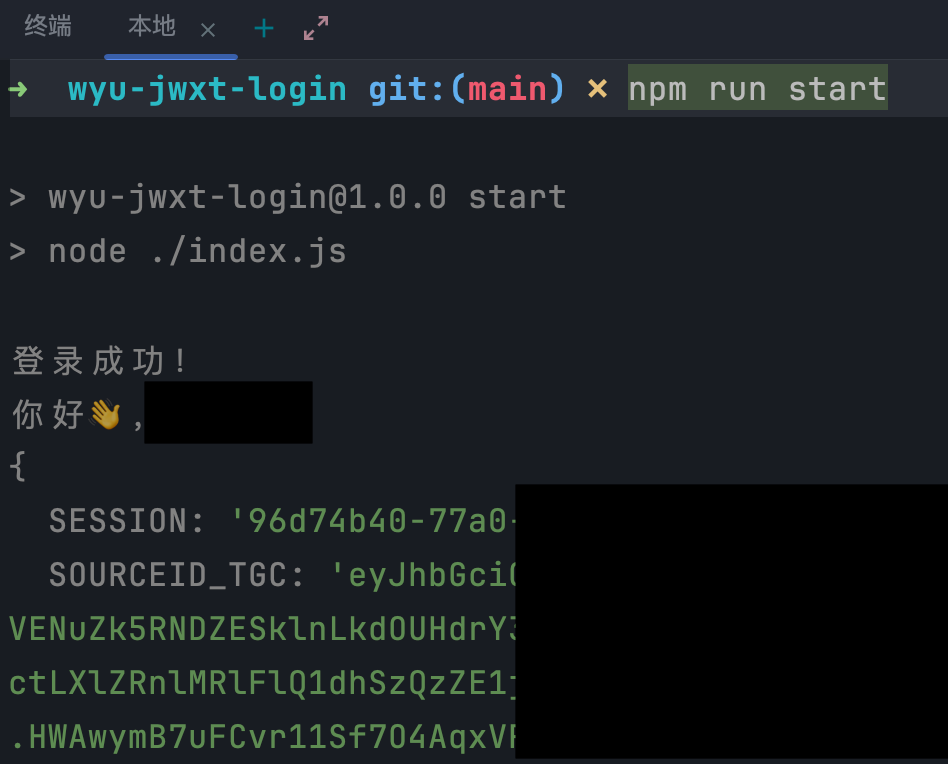

# 武夷学院-教务系统&统一认证平台登录
### 武夷学院统一认证平台登录模拟
在我写到这里的时候，武夷学院几乎所有系统都在使用统一认证平台进行身份认证。

一般情况下统一认证平台只在内网开放，请注意网络场景。

### 安装

```bash
npm install
```

### 启动
修改`index.js`文件中的账号密码。

控制台运行以下命令。
```bash
npm run start
```

成功示例：


### 文档

实现登录有三个步骤
1. #### 初始化（_initLogin）
    主要作用为获取一个键为`SESSION`的Cookie，以及拿到`execution`和`croypto`的值。
    
    接下来登录会用到这些。
2. #### 登录表单提交（login）
    这里只有一个密码加密，其他项没有特殊处理的。主要Cookie要携带上一步拿到的`SESSION`。
    
    主要返回一个重定向location和两个Cookie，储存起来，下一步要用。
3. #### 登录回调（login）
    携带上面所有的Cookie，请求上一步的location，服务器校验成功后返回两个Cookie。

    这两个Cookie就是我们的最终目的。

代码很容易理解，我不过多赘述。

_本仓库仅作为学习测试用途，分享学习经验，切勿他用_
